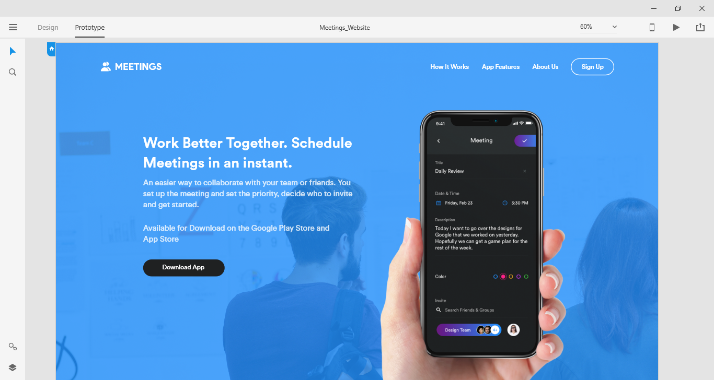

# Meetings Website

Live Preview: [https://ikuamike.github.io/meetings_website/](https://ikuamike.github.io/meetings_website/)

Static only website I created for my front-end development practice.

This is a one page website done in pure html and css and it has implemented [fullPage.js](https://github.com/alvarotrigo/fullPage.js) for better scrolling experience.

* Tutorial Link : [How to Design and Code an App Website - Part 1](https://youtu.be/tuEj7Tu30FI)
* Tutorial Link : [How to Design and Code an App Website - Part 2](https://youtu.be/Jg0YlDN-VIo)

